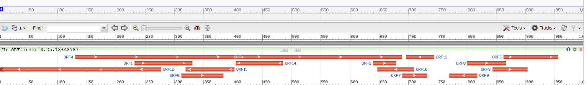
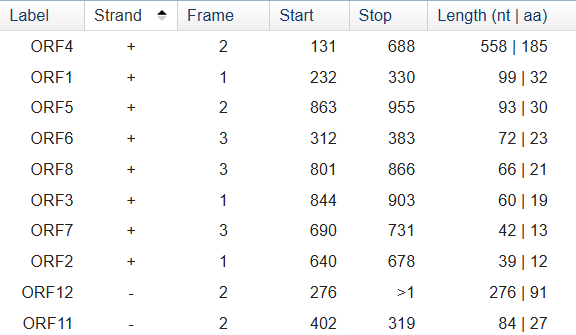

# Задание LVL 1

Исходный код в файле ```findorf.py```.
С помощью него можно найти открытые рамки считывания в точности как сказано в задании. 

Алгоритм: нашли старт-кодон >>> нашли ближайший стоп-кодон в той же последовательности >>> транслируем полученную открутую рамку считывания >>> вернулись и продолжили на том же месте (+1 нуклеотид) искать старт >>> <...>

__Замечание.__ ORFFinder не выдает последовательности с вложенными (что противорчеит с требованием в пункте [5.]). Причем он также убирает вложенные именно из конкретной рамки. То есть если будут две вложенные, то он уберет наименьшую если обе в конкретной рамке. Если же есть вложенные но они в разных рамках, то ничего не удалится на ORFFinder.
ORFFinder выдает последовательности также с точностью до реверс-комплементарности (Там их больше)
ORFFinder показывает последовательности (в лучшем случае) если по крайней мере длины 30[Однако с помощью ORFFinder о котором идет речь, можно указать и менее 30] (Мы же ищем всё всё всё)

# Разберём на конкретной последовательности 

Возьмём  [ENSG00000107018](https://grch37.ensembl.org/Homo_sapiens/Export/Output/Gene?db=core;flank3_display=0;flank5_display=0;g=ENSG00000046774;output=fasta;r=X:141290131-141293076;strand=feature;t=ENST00000247452;param=cdna;param=coding;param=peptide;param=utr5;param=utr3;param=exon;param=intron;genomic=unmasked;_format=Text)

Будем брать оттуда последовательности и сравнивать результаты полученные у нас ```OUTPUT.txt``` и в ORFFinder.

Рассмотрим первую последовательность. Вот, что получилось у нас:
 ``` 
In sequence 1 found res_num 1.ORF found at base 131 to base 685: ATGCCTCGCCTGTTCTTGTTCCACCTGCTAGAATTCTGTTTACTACTGAACCAATTTTCCAGAGCAGTCGCGGCCAAATGGAAGGACGATGTTATTAAATTATGCGGCCGCGAATTAGTTCGCGCGCAGATTGCCATTTGCGGCATGAGCACCTGGAGCAAAAGGTCTCTGAGCCAGGAAGATGCTCCTCAGACACCTAGACCAGTGGCAGAAATTGTACCATCCTTCATCAACAAAGATACAGAAACTATAATTATCATGTTGGAATTCATTGCTAATTTGCCACCGGAGCTGAAGGCAGCCCTATCTGAGAGGCAACCATCATTACCAGAGCTACAGCAGTATGTACCTGCATTAAAGGATTCCAATCTTAGCTTTGAAGAATTTAAGAAACTTATTCGCAATAGGCAAAGTGAAGCCGCAGACAGCAATCCTTCAGAATTAAAATACTTAGGCTTGGATACTCATTCTCAAAAAAAGAGACGACCCTACGTGGCACTGTTTGAGAAATGTTGCCTAATTGGTTGTACCAAAAGGTCTCTTGCTAAATATTGC 
 	 Translated gene on ptoteome: MPRLFLFHLLEFCLLLNQFSRAVAAKWKDDVIKLCGRELVRAQIAICGMSTWSKRSLSQEDAPQTPRPVAEIVPSFINKDTETIIIMLEFIANLPPELKAALSERQPSLPELQQYVPALKDSNLSFEEFKKLIRNRQSEAADSNPSELKYLGLDTHSQKKRRPYVALFEKCCLIGCTKRSLAKYC 
In sequence 1 found res_num 2.ORF found at base 208 to base 225: ATGGAAGGACGATGTTAT 
 	 Translated gene on ptoteome: MEGRCY 
In sequence 1 found res_num 3.ORF found at base 219 to base 245: ATGTTATTAAATTATGCGGCCGCGAAT 
 	 Translated gene on ptoteome: MLLNYAAAN 
In sequence 1 found res_num 4.ORF found at base 232 to base 327: ATGCGGCCGCGAATTAGTTCGCGCGCAGATTGCCATTTGCGGCATGAGCACCTGGAGCAAAAGGTCTCTGAGCCAGGAAGATGCTCCTCAGACACC 
 	 Translated gene on ptoteome: MRPRISSRADCHLRHEHLEQKVSEPGRCSSDT 
In sequence 1 found res_num 5.ORF found at base 275 to base 685: ATGAGCACCTGGAGCAAAAGGTCTCTGAGCCAGGAAGATGCTCCTCAGACACCTAGACCAGTGGCAGAAATTGTACCATCCTTCATCAACAAAGATACAGAAACTATAATTATCATGTTGGAATTCATTGCTAATTTGCCACCGGAGCTGAAGGCAGCCCTATCTGAGAGGCAACCATCATTACCAGAGCTACAGCAGTATGTACCTGCATTAAAGGATTCCAATCTTAGCTTTGAAGAATTTAAGAAACTTATTCGCAATAGGCAAAGTGAAGCCGCAGACAGCAATCCTTCAGAATTAAAATACTTAGGCTTGGATACTCATTCTCAAAAAAAGAGACGACCCTACGTGGCACTGTTTGAGAAATGTTGCCTAATTGGTTGTACCAAAAGGTCTCTTGCTAAATATTGC 
 	 Translated gene on ptoteome: MSTWSKRSLSQEDAPQTPRPVAEIVPSFINKDTETIIIMLEFIANLPPELKAALSERQPSLPELQQYVPALKDSNLSFEEFKKLIRNRQSEAADSNPSELKYLGLDTHSQKKRRPYVALFEKCCLIGCTKRSLAKYC 
In sequence 1 found res_num 6.ORF found at base 312 to base 380: ATGCTCCTCAGACACCTAGACCAGTGGCAGAAATTGTACCATCCTTCATCAACAAAGATACAGAAACTA 
 	 Translated gene on ptoteome: MLLRHLDQWQKLYHPSSTKIQKL 
In sequence 1 found res_num 7.ORF found at base 389 to base 685: ATGTTGGAATTCATTGCTAATTTGCCACCGGAGCTGAAGGCAGCCCTATCTGAGAGGCAACCATCATTACCAGAGCTACAGCAGTATGTACCTGCATTAAAGGATTCCAATCTTAGCTTTGAAGAATTTAAGAAACTTATTCGCAATAGGCAAAGTGAAGCCGCAGACAGCAATCCTTCAGAATTAAAATACTTAGGCTTGGATACTCATTCTCAAAAAAAGAGACGACCCTACGTGGCACTGTTTGAGAAATGTTGCCTAATTGGTTGTACCAAAAGGTCTCTTGCTAAATATTGC 
 	 Translated gene on ptoteome: MLEFIANLPPELKAALSERQPSLPELQQYVPALKDSNLSFEEFKKLIRNRQSEAADSNPSELKYLGLDTHSQKKRRPYVALFEKCCLIGCTKRSLAKYC 
In sequence 1 found res_num 8.ORF found at base 474 to base 485: ATGTACCTGCAT 
 	 Translated gene on ptoteome: MYLH 
In sequence 1 found res_num 9.ORF found at base 640 to base 675: ATGTTGCCTAATTGGTTGTACCAAAAGGTCTCTTGC 
 	 Translated gene on ptoteome: MLPNWLYQKVSC 
In sequence 1 found res_num 10.ORF found at base 690 to base 728: ATGAAGCTAATTGTGCACATCTTGTCTAATTTTCACACA 
 	 Translated gene on ptoteome: MKLIVHILSNFHT 
In sequence 1 found res_num 11.ORF found at base 737 to base 748: ATGACATTTCAC 
 	 Translated gene on ptoteome: MTFH 
In sequence 1 found res_num 12.ORF found at base 751 to base 777: ATGCTTCTGTCAGGTCCCACTAATTAT 
 	 Translated gene on ptoteome: MLLSGPTNY 
In sequence 1 found res_num 13.ORF found at base 801 to base 863: ATGTTTAGATTTTTCATTTGGTGTGTAAGAAAATATTCTTTGTATGATTGTAGTTTCTGTAAA 
 	 Translated gene on ptoteome: MFRFFIWCVRKYSLYDCSFCK 
In sequence 1 found res_num 14.ORF found at base 844 to base 900: ATGATTGTAGTTTCTGTAAATGACACTTTCTATGCTGAAGTCTTTTTGTCTTTTTAT 
 	 Translated gene on ptoteome: MIVVSVNDTFYAEVFLSFY 
In sequence 1 found res_num 15.ORF found at base 863 to base 952: ATGACACTTTCTATGCTGAAGTCTTTTTGTCTTTTTATTAACAGTATAATTGTGTTGATTCTTTTTAATGCTGTTAACTTAAAATTACAA 
 	 Translated gene on ptoteome: MTLSMLKSFCLFINSIIVLILFNAVNLKLQ 
In sequence 1 found res_num 16.ORF found at base 875 to base 952: ATGCTGAAGTCTTTTTGTCTTTTTATTAACAGTATAATTGTGTTGATTCTTTTTAATGCTGTTAACTTAAAATTACAA 
 	 Translated gene on ptoteome: MLKSFCLFINSIIVLILFNAVNLKLQ 
In sequence 1 found res_num 17.ORF found at base 930 to base 941: ATGCTGTTAACT 
 	 Translated gene on ptoteome: MLLT 

```
    
А что получилось в ORFFinder 


Ну или если быть чуть точнее:


Есть ещё парочка, но они все с "-"  в __"Strand"__, а мы всё же не рассматриваем реверс-комплементарные истории.

Действительно, можно заметить что *ORF4* фигурирует в наших записях:
>In sequence 1 found res_num 1.ORF found at base 131 to base 685: 
```
ATGCCTCGCCTGTTCTTGTTCCACCTGCTAGAATTCTGTTTACTACTGAACCAATTTTCCAGAGCAGTCGCGGCCAAATGGAAGGACGATGTTATTAAATTATGCGGCCGCGAATTAGTTCGCGCGCAGATTGCCATTTGCGGCATGAGCACCTGGAGCAAAAGGTCTCTGAGCCAGGAAGATGCTCCTCAGACACCTAGACCAGTGGCAGAAATTGTACCATCCTTCATCAACAAAGATACAGAAACTATAATTATCATGTTGGAATTCATTGCTAATTTGCCACCGGAGCTGAAGGCAGCCCTATCTGAGAGGCAACCATCATTACCAGAGCTACAGCAGTATGTACCTGCATTAAAGGATTCCAATCTTAGCTTTGAAGAATTTAAGAAACTTATTCGCAATAGGCAAAGTGAAGCCGCAGACAGCAATCCTTCAGAATTAAAATACTTAGGCTTGGATACTCATTCTCAAAAAAAGAGACGACCCTACGTGGCACTGTTTGAGAAATGTTGCCTAATTGGTTGTACCAAAAGGTCTCTTGCTAAATATTGC
``` 
> Translated gene on ptoteome: 
```
MPRLFLFHLLEFCLLLNQFSRAVAAKWKDDVIKLCGRELVRAQIAICGMSTWSKRSLSQEDAPQTPRPVAEIVPSFINKDTETIIIMLEFIANLPPELKAALSERQPSLPELQQYVPALKDSNLSFEEFKKLIRNRQSEAADSNPSELKYLGLDTHSQKKRRPYVALFEKCCLIGCTKRSLAKYC 
```

Или же такую запись можно даже найти обратившись в ORFFinder на [bioinformatics.org](https://www.bioinformatics.org/sms2/orf_find.html) 
```
>ORF number 1 in reading frame 2 on the direct strand extends from base 131 to base 688.
ATGCCTCGCCTGTTCTTGTTCCACCTGCTAGAATTCTGTTTACTACTGAACCAATTTTCC
AGAGCAGTCGCGGCCAAATGGAAGGACGATGTTATTAAATTATGCGGCCGCGAATTAGTT
CGCGCGCAGATTGCCATTTGCGGCATGAGCACCTGGAGCAAAAGGTCTCTGAGCCAGGAA
GATGCTCCTCAGACACCTAGACCAGTGGCAGAAATTGTACCATCCTTCATCAACAAAGAT
ACAGAAACTATAATTATCATGTTGGAATTCATTGCTAATTTGCCACCGGAGCTGAAGGCA
GCCCTATCTGAGAGGCAACCATCATTACCAGAGCTACAGCAGTATGTACCTGCATTAAAG
GATTCCAATCTTAGCTTTGAAGAATTTAAGAAACTTATTCGCAATAGGCAAAGTGAAGCC
GCAGACAGCAATCCTTCAGAATTAAAATACTTAGGCTTGGATACTCATTCTCAAAAAAAG
AGACGACCCTACGTGGCACTGTTTGAGAAATGTTGCCTAATTGGTTGTACCAAAAGGTCT
CTTGCTAAATATTGCTGA

>Translation of ORF number 1 in reading frame 2 on the direct strand.
MPRLFLFHLLEFCLLLNQFSRAVAAKWKDDVIKLCGRELVRAQIAICGMSTWSKRSLSQE
DAPQTPRPVAEIVPSFINKDTETIIIMLEFIANLPPELKAALSERQPSLPELQQYVPALK
DSNLSFEEFKKLIRNRQSEAADSNPSELKYLGLDTHSQKKRRPYVALFEKCCLIGCTKRS
LAKYC*
```
Также и все остальные *ORF 1 2 3 4 5 6 7 8* можем без труда найти в наших записях
__Замечание.__ У нас в ORF не учитывался стоп-кодон, а вот в данном инструменте его длина учитывается. Этим объясняется разница номеров нуклеотидов конца на 3.

**Но почему нет некоторых других..?**

Например такого:
>In sequence 1 found res_num 5.ORF found at base 275 to base 685: 
```
ATGAGCACCTGGAGCAAAAGGTCTCTGAGCCAGGAAGATGCTCCTCAGACACCTAGACCAGTGGCAGAAATTGTACCATCCTTCATCAACAAAGATACAGAAACTATAATTATCATGTTGGAATTCATTGCTAATTTGCCACCGGAGCTGAAGGCAGCCCTATCTGAGAGGCAACCATCATTACCAGAGCTACAGCAGTATGTACCTGCATTAAAGGATTCCAATCTTAGCTTTGAAGAATTTAAGAAACTTATTCGCAATAGGCAAAGTGAAGCCGCAGACAGCAATCCTTCAGAATTAAAATACTTAGGCTTGGATACTCATTCTCAAAAAAAGAGACGACCCTACGTGGCACTGTTTGAGAAATGTTGCCTAATTGGTTGTACCAAAAGGTCTCTTGCTAAATATTGC 
```
>Translated gene on ptoteome: 
```
MSTWSKRSLSQEDAPQTPRPVAEIVPSFINKDTETIIIMLEFIANLPPELKAALSERQPSLPELQQYVPALKDSNLSFEEFKKLIRNRQSEAADSNPSELKYLGLDTHSQKKRRPYVALFEKCCLIGCTKRSLAKYC 
```

Он вложен в *ORF 4* (так как его начало сравнимо по модулю 3 с началом ORF 4 $ \Longrightarrow $ значит в одной рамке *Frame*). Да и к тому же начинается он позже, и притом он намного короче:


__Tretyakov__ __Ivan__
__tg: @pheoctist__